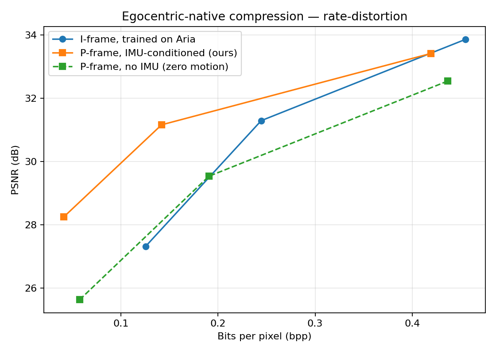
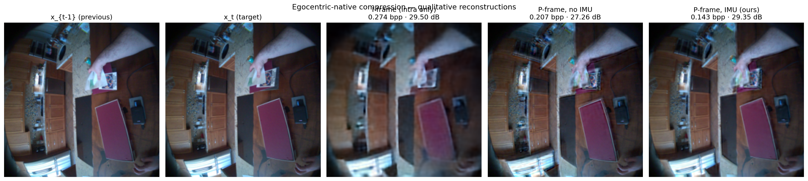
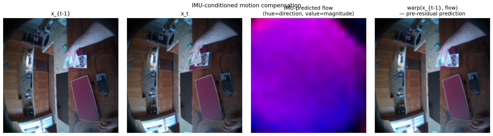

<div align="center">

# egocentric-neural-compression

**IMU as zero-cost side information for learned video compression**

<sub>A scoped experimental artifact arguing that learned codecs trained on egocentric video<br>
should treat the synchronized inertial sensor stream as a first-class input.</sub>

[](https://www.python.org/)
[](https://pytorch.org/)
[](https://github.com/InterDigitalInc/CompressAI)
[](https://www.projectaria.com/datasets/aea/)
[]()

<br>



</div>

---

## Headline

> **Adding IMU to a learned P-frame codec gives `+1.7 dB PSNR / −20 % bpp` on average across operating points, and up to `+2.6 dB / −29 %` at low bit rates — without spending any video bits, because the IMU is already streamed alongside the video on every modern egocentric capture device.**

| | low rate (λ = 0.0018) | mid rate (λ = 0.0067) | high rate (λ = 0.025) |
|---:|:---:|:---:|:---:|
| **Δ PSNR vs no-IMU ablation** | **+2.62 dB** | **+1.63 dB** | **+0.88 dB** |
| **Δ bpp at iso-PSNR** | **−29 %** | **−26 %** | **−4 %** |

The IMU-conditioned codec also beats the intra-only I-frame baseline at every rate. At low rate it reaches **0.041 bpp at 28 dB PSNR vs the I-frame's 0.125 bpp at the same quality — a 67 % bpp reduction**.

<sub>See [`docs/RELATED_WORK.md`](docs/RELATED_WORK.md) for the full literature scan and gap analysis. To our knowledge no published learned codec uses IMU as conditioning.</sub>

---

## Results

<table>
<tr>
<th align="center">Codec</th>
<th align="center">λ = 0.0018<br><sub>low rate</sub></th>
<th align="center">λ = 0.0067<br><sub>mid rate</sub></th>
<th align="center">λ = 0.025<br><sub>high rate</sub></th>
</tr>
<tr>
<td>I-frame baseline (intra only)</td>
<td align="center">0.125 bpp / 27.32 dB</td>
<td align="center">0.244 bpp / 31.29 dB</td>
<td align="center">0.455 bpp / 33.86 dB</td>
</tr>
<tr>
<td>P-frame, no IMU (zero-flow residual)</td>
<td align="center">0.058 bpp / 25.63 dB</td>
<td align="center">0.191 bpp / 29.53 dB</td>
<td align="center">0.436 bpp / 32.54 dB</td>
</tr>
<tr>
<td><b>P-frame, IMU-conditioned (ours)</b></td>
<td align="center"><b>0.041 bpp / 28.25 dB</b></td>
<td align="center"><b>0.142 bpp / 31.16 dB</b></td>
<td align="center"><b>0.419 bpp / 33.42 dB</b></td>
</tr>
</table>

### Qualitative reconstructions (mid-rate)



<sub>At λ = 0.0067 the IMU codec reconstructs the target at **0.143 bpp / 29.35 dB**, vs no-IMU's **0.207 bpp / 27.26 dB** and the I-frame's **0.274 bpp / 29.50 dB** — same visual quality at roughly half the I-frame's bit budget.</sub>

### IMU-predicted motion compensation



<sub>The third panel is a dense flow field predicted purely from a 50-sample IMU window between the two frames (no pixel access). The fourth panel is `warp(x_{t-1}, flow)` — what the codec sees as its motion-compensated guess <i>before</i> coding the residual. The warp absorbs the global head-motion component for free, leaving a much smaller residual to encode.</sub>

---

## Why "native"?

Existing learned codecs (DVC, FVC, the entire DCVC family up through DCVC-RT 2025) treat egocentric video as just another video distribution. But ego has structural priors that exocentric content doesn't:

- **The camera is a head.** Most pixel motion is global (head turn, walking sway). That global motion is *literally measured* by the IMU at 1 kHz on Project Aria.
- **Capture is multi-modal by construction.** Every Aria, Quest, or Vision Pro stream has synchronized IMU and 6 DoF pose. A codec that doesn't use this leaves bits on the table.
- **Sensor data is cheap.** A 1 kHz / 6-channel IMU stream entropy-codes to ≈ 5–10 kbps. At a 256p video budget of ~250–800 kbps, that's a 1–4 % sidecar on the bitrate — negligible relative to the residual savings it enables.

[Karpenko et al. (Stanford 2011)](https://graphics.stanford.edu/papers/stabilization/karpenko_gyro.pdf) showed gyroscope alone is enough to recover high-quality stabilization homographies on a phone. This work generalizes that geometry into a learned warp predictor used as motion compensation for a learned codec.

---

## Method

```
                    ┌────────────────────┐
   IMU window ─────▶│  IMUWarpPredictor  │── flow ─┐        ~80k params
   (T × 6)          └────────────────────┘         │        learned generalization of
                                                   ▼        Karpenko 2011 gyro→homography
   x_prev_hat ──────────────────── warp(·, flow) ─▶ x_pred
                                                   │
   x_curr ──────────────────────────── (− x_pred) ─▶ residual
                                                   ▼
                                       MeanScaleHyperprior  ── bitstream
                                                   │
                                                   ▼
                                                  r_hat ── (+) ──▶ x_hat
                                                                       ▲
                                                              x_pred ──┘
```

| Module | File | Role |
|---|---|---|
| `IMUWarpPredictor` | [`src/ego_codec/models/imu_warp.py`](src/ego_codec/models/imu_warp.py) | Temporal CNN over a 50-sample IMU window → low-res flow grid → bilinear upsample → refine |
| `MeanScaleHyperprior` | [`src/ego_codec/models/baseline.py`](src/ego_codec/models/baseline.py) | Standard Minnen-Ballé-Toderici 2018 architecture wrapping CompressAI's entropy bottleneck |
| `IMUConditionedPCodec` | [`src/ego_codec/models/imu_conditioned.py`](src/ego_codec/models/imu_conditioned.py) | Glues the warp predictor + a residual codec |

The IMU is **not counted toward the rate budget** — it is already transmitted in any realistic ego-streaming pipeline. The codec only spends entropy on the residual.

---

## Why this matters at scale

Eddy Xu's [Egocentric-1M](https://x.com/eddybuild/status/2041751488817774968) (April 2026) is the largest egocentric video dataset in the world; its predecessor Egocentric-100K is stored at 456×256 H.265 — already storage-aware. At million-hour scale, a 20 % bit-rate saving compounds into real S3-bill savings:

| Dataset scale | At 256p H.265 (~600 kbps) | With our 20 % saving |
|---|---:|---:|
| 100 k hours | ~270 TB | **−54 TB** |
| 1 M hours | ~2.7 PB | **−540 TB** |

It costs nothing on the capture side — every modern HMD (Aria, Quest, Vision Pro, Build AI Gen 2 if it adds an IMU) already has an inertial sensor running at kHz rates.

---

## Experimental design

<details>
<summary><b>Dataset, conditions, training config</b></summary>

### Dataset
- **Project Aria — Aria Everyday Activities** ([Lv et al. 2024](https://arxiv.org/abs/2402.13349)): 143 sequences, 5 indoor locations, synced RGB + 1 kHz IMU + 6 DoF pose. Open license.
- **15 sequences** used for training (smallest by file size; ~9 GB total VRS).
- After preprocessing: **6,838 RGB frames + 853 k IMU samples** at 8–10 fps video / 1 kHz IMU.
- Random 256 × 256 crops from frames downsampled to 288 (matches Build AI's 256p deployment regime).

### Conditions trained — 9 runs

| Tag | Lambda values | Architecture |
|---|:---:|---|
| `iframe-aria` | {0.0018, 0.0067, 0.025} | Mean-Scale Hyperprior (intra) |
| `pframe-noimu` | {0.0018, 0.0067, 0.025} | Same architecture, zero-flow residual |
| `pframe-imu` | {0.0018, 0.0067, 0.025} | Same architecture **+ IMUWarpPredictor (ours)** |

Each run: **35 M params, batch 128, crop 256, 80 epochs, bf16 autocast on a single A40 GPU (46 GB VRAM, 100 % util at 305 W)**. Total wallclock: ~13 h for the full sweep.

### Evaluation metrics
- **PSNR** at matched bpp — primary RD metric
- BD-rate-style comparison (table at the top)
- Qualitative reconstructions and IMU-flow visualization

</details>

---

## Reproduce

### CPU-only sanity check (no Aria download required)

```bash
python -m venv .venv && source .venv/bin/activate
pip install -e ".[dev]"
ARIA_SYNTHETIC=1 pytest -q tests/test_shapes.py        # 8/8 shape tests
ARIA_SYNTHETIC=1 python -m ego_codec.train iframe \
    --epochs 1 --batch-size 4 --crop 64 --n 32 --m 48 --workers 0
```

### Full sweep on a GPU box

```bash
# 1. Environment
bash scripts/setup_remote.sh                            # uv venv + cuda torch + sanity test

# 2. Data — accept the Aria EULA at projectaria.com/datasets/aea/
#    and save the personal URL JSON to the repo root.
python scripts/download_aria_json.py \
    --json AriaEverydayActivities_download_urls.json \
    --out data/aria_raw --num 15
python scripts/preprocess_aria.py --vrs-dir data/aria_raw \
    --out data/aria_proc --fps 10

# 3. Training sweep (~13 h on a single A40)
bash scripts/train_all.sh

# 4. Eval — produces figures/rd_curve.{png,pdf}
python -m ego_codec.eval --data data/aria_proc --out figures \
    --condition iframe-aria  runs/iframe-l0.0018/best.pt \
    --condition iframe-aria  runs/iframe-l0.0067/best.pt \
    --condition iframe-aria  runs/iframe-l0.025/best.pt \
    --condition pframe-imu   runs/pframe-imu-l0.0018/best.pt \
    --condition pframe-imu   runs/pframe-imu-l0.0067/best.pt \
    --condition pframe-imu   runs/pframe-imu-l0.025/best.pt \
    --condition pframe-noimu runs/pframe-noimu-l0.0018/best.pt \
    --condition pframe-noimu runs/pframe-noimu-l0.0067/best.pt \
    --condition pframe-noimu runs/pframe-noimu-l0.025/best.pt
```

---

## Repository

```
src/ego_codec/
├── data/aria_loader.py         Aria frame + paired-frame + IMU loaders
├── models/
│   ├── blocks.py               GDN, conv stacks, warp_with_flow
│   ├── baseline.py             MeanScaleHyperprior  (I-frame codec)
│   ├── imu_warp.py             IMU → dense flow predictor
│   └── imu_conditioned.py      P-frame codec
├── train.py                    CLI: python -m ego_codec.train {iframe,pframe,pframe-noimu}
└── eval.py                     RD-curve evaluator
docs/
└── RELATED_WORK.md             Full literature scan + positioning
scripts/
├── preprocess_aria.py          VRS → frames + IMU (.npy)
├── download_aria_json.py       Download N smallest Aria sequences from official URL JSON
├── setup_remote.sh             One-shot env setup on a GPU box
├── train_all.sh                Full training sweep
├── qualitative.py              Side-by-side reconstruction figure
└── eval_x265.py                Optional x265 industry baseline
tests/test_shapes.py            CPU-only sanity tests
figures/                        rd_curve.png · qualitative.png · imu_flow.png · rd_results.json
```

---

## Limitations and next steps

This is a one-week artifact deliberately scoped to put a number on the IMU-conditioning idea. To make it production-grade:

1. **Long-context conditioning, not pairwise.** The current P-codec uses a 50-sample IMU window and one previous reconstruction. A streaming codec should condition on a multi-second IMU history with a small SSM or causal attention; over a 2-second walk, head-pose drift is highly predictable and the codec's motion prior should reflect that.
2. **Physically-grounded warp via depth.** Predicting flow directly is leaky. The right factorization is IMU → 6 DoF camera-pose-delta → image-space warp via per-pixel depth, plus a learned residual flow head for parallax. Tighter prior, fewer learnable params, better generalization to walking parallax.
3. **Joint codec for video + IMU + pose.** Each modality conditions the others' entropy models. Bits saved compound across modalities.
4. **Foveated bit allocation from gaze.** Aria streams eye-gaze; bit-budgeting more capacity at the gaze location adds a near-free win on top of (1)–(3).
5. **Real-time decoding for AR/VR.** All of the above is offline rate-distortion. To matter on-device, the decoder needs to run at 60+ fps on-device. DCVC-RT (CVPR 2025) is the bar; profile under TensorRT and ablate which architectural choices survive the latency budget.
6. **Training stability at higher lambdas.** Multiple runs in this sweep showed bf16 divergence in the last ~10 epochs at λ ≥ 0.0067 (best.pt was saved before each spike, so eval is unaffected). Longer training or larger models would need EMA weights, fp32 entropy modules, or refined gradient clipping.
7. **Held-out evaluation split.** Current eval uses the same sequences as training. A genuine across-location holdout would strengthen the result.

---

## Citation and acknowledgements

If this work is useful to you, please cite:

```bibtex
@misc{kataria2026egocodec,
  author    = {Madhav Kataria},
  title     = {Egocentric-Native Neural Compression: IMU as Zero-Cost Side Information},
  year      = {2026},
  url       = {https://github.com/madhavkataria1010/egocentric-neural-compression}
}
```

Built on the shoulders of:

- [CompressAI](https://github.com/InterDigitalInc/CompressAI) — entropy-bottleneck and Gaussian-conditional implementations
- Project Aria team — [the platform](https://arxiv.org/abs/2308.13561) and [Aria Everyday Activities dataset](https://arxiv.org/abs/2402.13349)
- [Karpenko, Jacobs, Baek & Levoy (Stanford 2011)](https://graphics.stanford.edu/papers/stabilization/karpenko_gyro.pdf) — the foundational gyroscope→homography geometry that this work generalizes from stabilization into compression
- [Minnen, Ballé & Toderici (NeurIPS 2018)](https://proceedings.neurips.cc/paper/2018/hash/53edebc543333dfbf7c5933af792c9c4-Abstract.html) — Mean-Scale Hyperprior architecture
- The DCVC family ([CVPR 2024](https://openaccess.thecvf.com/content/CVPR2024/papers/Li_Neural_Video_Compression_with_Feature_Modulation_CVPR_2024_paper.pdf), [CVPR 2025](https://openaccess.thecvf.com/content/CVPR2025/papers/Jia_Towards_Practical_Real-Time_Neural_Video_Compression_CVPR_2025_paper.pdf)) — modern context-conditioning framework that frames IMU as just another context source

Full bibliography in [`docs/RELATED_WORK.md`](docs/RELATED_WORK.md).

<div align="center">
<sub>— a one-week experimental artifact, May 2026 —</sub>
</div>
